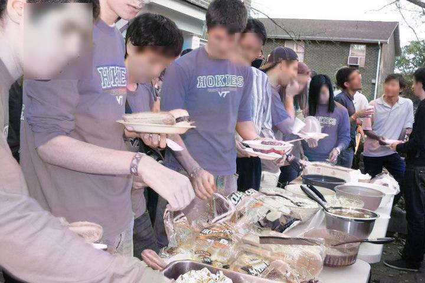

# Bias in Automated Image Colorization: Metrics and Error Types

This repository contains examples of colorized images. All images are colorized using the `artistic` model from DeOldify.

## Images
For each reason, we selected the image with the highest value. Images of humans are examples that were not chosen through specific values.

Ground Truth | Colorized | Image ID | Reason | Value | 
---|---|---|---|---
             |              | 00000136 | human               | -
             |              | 00002262 | human               | -
 |  | 00005581 | third_bottom_diff   | 77.414
             |              | 00006607 | human               | -
    |     | 00006700 | third_top_diff      | 69.757
       |        | 00012765 | center_average_diff | 81.819
             |              | 00023303 | human               | -
  |   | 00024091 | gold_dots_diff      | 62.353
             |              | 00024474 | human               | -
   |    | 00024567 | third_left_diff     | 75.708

## Structure
### `images/`
Contains two files for each image and a `values.md` that explains why the image was chosen.
